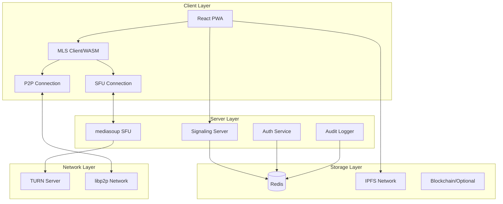
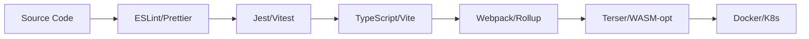

# 🏗️ OpenCall Architecture

## Overview

OpenCall is a decentralized, zero-knowledge meeting platform built with a focus on security, scalability, and user experience. This document describes the technical architecture and design decisions.

## System Architecture



## Core Components

### 1. Client Application (PWA)

**Technology**: React 18, TypeScript, Vite
**Architecture**: Component-based with hooks

```typescript
// Component hierarchy
App
├── HomePage
├── MeetingPage
│   ├── MeetingLobby
│   │   ├── DeviceSelector
│   │   └── NameInput
│   └── MeetingRoom
│       ├── VideoGrid
│       ├── MediaControls
│       ├── Chat
│       └── FileSharing
└── AdminDashboard
    ├── Analytics
    ├── Compliance
    └── AuditLogs
```

**Key Features**:
- Progressive Web App with offline support
- Service Worker for caching and background tasks
- WebAssembly for cryptographic operations
- Responsive design following Apple HIG

### 2. WebRTC Architecture

**Hybrid P2P/SFU Model**:

```
Participants | Connection Type | Architecture
-------------|-----------------|-------------
2-3          | P2P            | Mesh network via simple-peer
4+           | SFU            | Star topology via mediasoup
```

**Connection Flow**:
1. Initial connection via WebSocket signaling
2. ICE candidate exchange
3. DTLS handshake
4. SRTP media streams
5. E2E encryption layer (MLS)

### 3. Encryption Architecture

**Multi-Layer Security**:

```
Application Layer:  MLS Protocol (Group E2E Encryption)
                   ↓
Media Layer:       Frame-level encryption (AES-GCM)
                   ↓
Transport Layer:   DTLS 1.3 (WebRTC)
                   ↓
Network Layer:     TLS 1.3 (Signaling)
```

**MLS Implementation**:
- Rust implementation compiled to WASM
- Automatic key rotation on member changes
- Forward secrecy and post-compromise security
- < 10ms encryption overhead

### 4. Authentication System

**Zero-Knowledge SRP Protocol**:

```
Client                          Server
  |                               |
  |------ Username + A -------->  |
  |                               |
  |<----- Salt + B + u --------   |
  |                               |
  |------ M1 (proof) --------->   |
  |                               |
  |<----- M2 (proof) + JWT ----   |
  |                               |
```

**Session Management**:
- JWT tokens for authenticated sessions
- Ephemeral identities for anonymous users
- Redis-backed session storage
- Automatic token refresh

### 5. Server Architecture

**Microservices Design**:

```
                    Load Balancer
                         |
    +--------+----------+----------+--------+
    |        |          |          |        |
Signaling  Media1    Media2    Media3    API
    |        |          |          |        |
    +--------+----------+----------+--------+
                         |
                      Redis
```

**Components**:
- **Signaling Server**: WebSocket handling, room management
- **Media Servers**: mediasoup workers for SFU
- **API Server**: REST endpoints, admin functions
- **Redis**: Session storage, pub/sub, caching

### 6. Data Storage

**Distributed Storage Strategy**:

| Data Type | Storage | Encryption | Retention |
|-----------|---------|------------|-----------|
| User Sessions | Redis | Server-side | 24 hours |
| Meeting State | Redis | Server-side | Duration + 1hr |
| Shared Files | IPFS | Client-side (MLS) | 7 days |
| Audit Logs | Redis → S3 | At-rest | 30-365 days |
| Recordings | IPFS/S3 | Client-side | User-defined |

### 7. Networking Layer

**P2P Discovery**:
- libp2p with WebRTC transport
- Kademlia DHT for peer discovery
- Circuit relay for NAT traversal
- mDNS for local network discovery

**STUN/TURN Configuration**:
```javascript
{
  iceServers: [
    { urls: 'stun:stun.l.google.com:19302' },
    { urls: 'stun:stun1.l.google.com:19302' },
    {
      urls: 'turn:turn.opencall.io:3478',
      username: 'dynamic',
      credential: 'generated'
    }
  ]
}
```

## Scalability Design

### Horizontal Scaling

**Media Server Scaling**:
- CPU-based auto-scaling
- Geo-distributed deployment
- Client routing based on latency
- Pipe transports between servers

**Load Distribution**:
```
Region: US-East
├── Media-1: 40% load (200 users)
├── Media-2: 35% load (175 users)
└── Media-3: 25% load (125 users)
```

### Performance Optimizations

1. **Client-Side**:
   - Lazy loading of components
   - WASM for crypto operations
   - Web Workers for encryption
   - Virtual DOM optimization

2. **Server-Side**:
   - Worker thread pools
   - Redis connection pooling
   - Efficient codec selection
   - Bandwidth adaptation

3. **Network**:
   - CDN for static assets
   - GeoDNS routing
   - HTTP/3 support
   - WebRTC simulcast

## Security Architecture

### Defense in Depth

```
Layer 1: Application Security
- Input validation
- CSRF protection
- XSS prevention
- SQL injection prevention

Layer 2: Transport Security
- TLS 1.3 minimum
- Certificate pinning
- HSTS enforcement
- Perfect forward secrecy

Layer 3: Infrastructure Security
- Network segmentation
- Firewall rules
- DDoS protection
- Rate limiting

Layer 4: Operational Security
- Security monitoring
- Incident response
- Regular audits
- Penetration testing
```

### Compliance Architecture

**Data Privacy**:
- GDPR: Right to erasure, data portability
- HIPAA: BAA support, audit controls
- SOC 2: Type II certification

**Audit Trail**:
```typescript
interface AuditEvent {
  id: string;
  timestamp: Date;
  eventType: AuditEventType;
  userId?: string;
  ipAddress: string;
  metadata: Record<string, any>;
  encrypted: boolean;
}
```

## Deployment Architecture

### Production Setup

```yaml
# Kubernetes deployment
apiVersion: apps/v1
kind: Deployment
metadata:
  name: opencall-media
spec:
  replicas: 3
  selector:
    matchLabels:
      app: media-server
  template:
    spec:
      containers:
      - name: mediasoup
        image: opencall/media:latest
        resources:
          requests:
            cpu: 2
            memory: 4Gi
          limits:
            cpu: 4
            memory: 8Gi
```

### Monitoring Stack

- **Metrics**: Prometheus + Grafana
- **Logs**: ELK Stack (Elasticsearch, Logstash, Kibana)
- **Traces**: OpenTelemetry + Jaeger
- **Alerts**: PagerDuty integration

## Development Architecture

### Monorepo Structure

```
pnpm workspaces
├── packages/core      # Shared code
├── packages/client    # Frontend
├── packages/server    # Backend
├── packages/protocol  # Crypto/WASM
└── packages/contracts # Smart contracts
```

### Build Pipeline



### Testing Strategy

- **Unit Tests**: 80% coverage minimum
- **Integration Tests**: API endpoints, WebRTC flows
- **E2E Tests**: Critical user journeys
- **Load Tests**: 500+ concurrent users
- **Security Tests**: OWASP compliance

## Future Architecture

### Phase 4: Blockchain Integration

```
Smart Contracts
├── MeetingRegistry.sol    # On-chain meeting records
├── AccessControl.sol      # Feature gates
├── GovernanceToken.sol    # DAO voting
└── RevenueShare.sol      # Contributor rewards
```

### Phase 5: AI Integration

- Real-time transcription
- Meeting summarization
- Noise cancellation
- Virtual backgrounds
- Language translation

## Architecture Principles

1. **Security First**: Every decision prioritizes user privacy
2. **User Experience**: Simple, fast, intuitive
3. **Decentralization**: No single point of failure
4. **Open Standards**: WebRTC, MLS, libp2p
5. **Modularity**: Loosely coupled components
6. **Performance**: Sub-second latency targets
7. **Scalability**: Horizontal scaling by design

## Technology Decisions

| Decision | Choice | Rationale |
|----------|--------|-----------|
| Language | TypeScript | Type safety, ecosystem |
| Frontend | React | Component model, ecosystem |
| Encryption | MLS | Standard, group support |
| P2P | libp2p | Modular, WebRTC support |
| SFU | mediasoup | Performance, flexibility |
| Database | Redis | Performance, pub/sub |
| Container | Docker | Portability, ecosystem |

## Performance Benchmarks

- **Connection establishment**: < 3 seconds
- **Encryption overhead**: < 10ms
- **Frame processing**: < 5ms
- **Audio latency**: < 150ms
- **Video latency**: < 200ms
- **Chat delivery**: < 100ms
- **File upload**: 10MB/s
- **Concurrent users**: 500/server

---

This architecture is designed to evolve. We welcome contributions and discussions about improvements. See [CONTRIBUTING.md](CONTRIBUTING.md) for how to get involved.